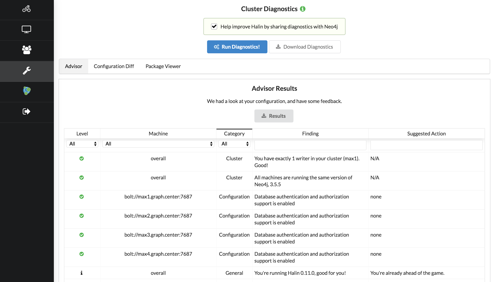

[](https://circleci.com/gh/moxious/halin)

## Halin Neo4j Monitoring

Halin is a Graph App for monitoring your Neo4j instance, or cluster.  It works with both
single instance graphs (like those you create in Desktop) and also remote connections to 
Causal Clusters.

**[Click here to run Halin!](http://halin.s3-website-us-east-1.amazonaws.com/)**

Primary features:
1. Basic performance monitoring (system load, memory usage)
2. Advisor and Diagnostics:  Checks your Neo4j configuration and finds problems, makes suggestions on how to improve.
3. Works with both Neo4j Enterprise and Neo4j Community
4. User & Role Management: allows you to administer users & roles across any number of machines.

## Running Halin in Development Mode

1. Clone the repo
2. `yarn install`
3. `yarn start`
4. Navigate to `http://localhost:3000/`

### Running Stand Alone

Browse to http://localhost:3000/ and you're ready to go.

### Running in Docker

```
docker run -d -p 127.0.0.1:3000:3000 --rm -t mdavidallen/halin:latest 
```

Open a browser to http://localhost:3000/

If you'd like to build the Halin docker container from source:

```
docker build -t halin:latest -f Dockerfile .
```

### Running as a GraphApp

4. Inside of Neo4j Desktop, go to application settings, scroll all the way to the bottom, enable development mode
5. For development app entry point, use http://localhost:3000/ (that's where yarn start will serve the app)
6. For development app root path, enter /absolute/path/to/halin where you cloned the repo
7. Finally, inside of desktop you'll see a special tile labeled "Development App 9.9.9".  This will
point to your running copy of Halin

## FAQ

1. Does it support Neo4j Enterprise or Community?

Both.  Some features must be disabled for community (such as user management) because community does not support them.  For a comparison of features between Neo4j Enterprise and Community, [see this link](https://neo4j.com/subscriptions/#editions)

2. Does Halin capture any data about my database?

Halin runs purely in your browser and does not share details of your database outside of
your machine.  Even when you generate a diagnostic package, this is not shared.  Halin 
does use a JS error reporting library called Sentry to help catch errors and improve the
software, but nothing about your configuration is sent back to me.

3. How does Halin work?

Halin uses pure cypher/bolt connections to nodes in your cluster, and uses Neo4j's existing
management interfaces and queries, including things like JMX, to obtain all statistics.  The upside
of this approach is that it will work on any Neo4j instance with zero modification or configuration.
The downside is that there are certain aspects of debugging (like getting remote log files) that Halin
cannot yet access because this would require server-side SSH access.

4. Do I have to run Halin as an admin user?

No, but some types of data (for example your configuration) are not available unless you
are an administrator.  If you run halin with a low privileged user, some features may not
be available or work as expected.

5. Why is it called Halin?

The application is named for [Rudolf Halin](https://en.wikipedia.org/wiki/Rudolf_Halin) an
influential German graph theorist, who came up with (among many other things) [Halin graphs](https://en.wikipedia.org/wiki/Halin_graph).

## Installing Halin in Neo4j Desktop

**Neo4j Desktop minimum version 1.1.10 is required.**

1. Open Neo4j Desktop
2. Click on the "Graph Applications" tile at left
3. Scroll to the bottom where it says "Install Graph Application"
4. Enter the URL `https://neo.jfrog.io/neo/api/npm/npm/halin` into the box
5. Click install

That's it.  As Neo4j Desktop is installed, and as new versions of Halin are available,
you'll catch updates.

## Screenshots




## Serve in Neo4j Desktop env
To serve it as a graph application, read the docs for that in the Neo4j Desktop development pages.
